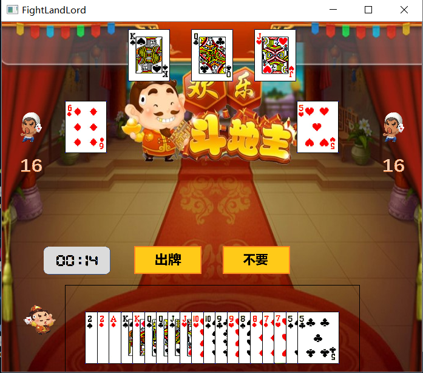
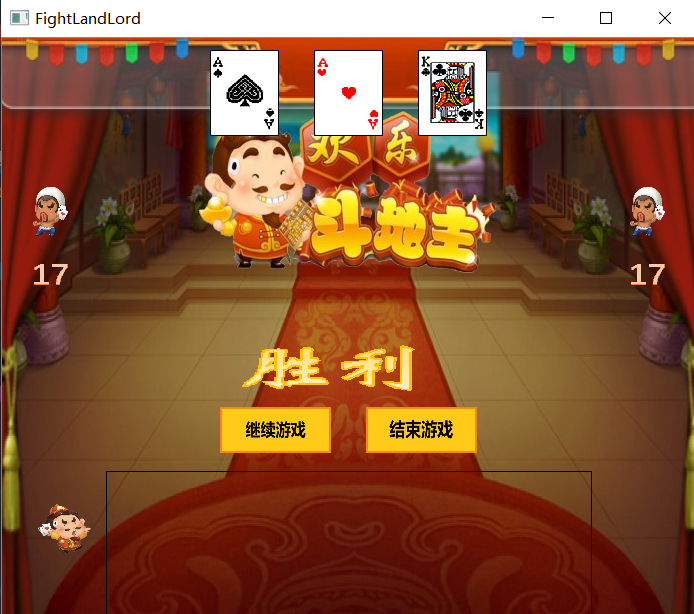
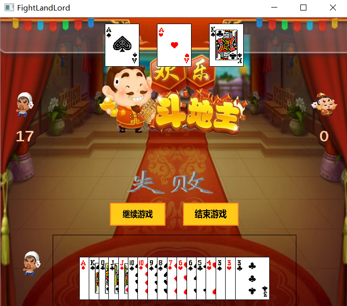

# 一. 问题及背景

​	斗地主是一项经典的三人游戏，玩家根据身份和规则打出手中的牌，最终牌出完的一方获胜。本项目主要实现在线斗地主，能够允许玩家在客户端上与其他人同台竞技，软件用户界面良好、操作简单、功能明确。

# 二. 开发计划

| 任务                                     | 所需时间(天) |
| ---------------------------------------- | ------------ |
| 需求分析                                 | 1            |
| 技术准备，熟悉`Qt`框架，搭建环境         | 2            |
| 第一轮迭代，实现进入房间                 | 3            |
| 第二轮迭代，实现准备，发牌，叫地主       | 1            |
| 第三轮迭代，实现出牌，规则判定和胜负判定 | 2            |
| 第四轮迭代，实现多房间功能，计时功能     | 2            |

# 三. 分工任务

| 组员   | 分工                                         |
| ------ | -------------------------------------------- |
| 余瑞璟 | `App`层实现，`Socket`层实现，服务端程序实现  |
| 张彦哲 | `Common`层实现，`Model`层及`ViewModel`层实现 |
| 刘举科 | `Window`层及`View`层实现                     |

# 四. 迭代效果说明

## 1. 第一轮迭代

​	实现进入房间

## 2. 第二轮迭代

​	实现准备，发牌，叫地主

## 3. 第三轮迭代

​	实现出牌，规则判定和胜负判定

## 4. 第四轮迭代

​	实现多房间功能，计时功能

# 五.最终运行效果图

