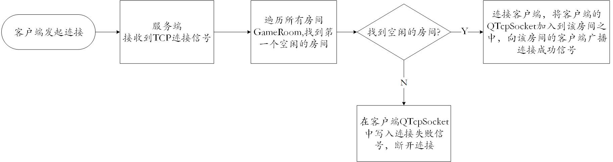

1. 分工任务

- **客户端App层实现**

  - 负责初始化`Window`和`ViewModel`模块，同时实现属性绑定、命令绑定和通知绑定。
- **网络通信功能实现**

  - 包括服务端程序和客户端`Socket`模块实现，服务端维护多个游戏房间，利用TCP传输协议实现与多个客户端的连接控制、数据传递。客户端内部数据改变时发送给服务端，服务端收到客户端数据后，广播给所有的客户端，客户端收到服务端广播数据后，通知`Model`层改变数据。

    

2. 解决方案

- 利用`Qt`框架中的信号与槽机制实现命令绑定、通知绑定，利用`C++`智能指针类实现属性绑定。

- 利用`Qt`框架中的`QTcpServer`类和`QTcpSocket`类实现网络通信TCP传输。

- 预先定义数据传输规则用于客户端-服务器及客户端内部传输数据的转化。

  

3. 设计思路

- **App层设计思路：**

  - `App`层作用为其设计较为简单，调用二者的初始化函数实现初始化。对于属性绑定，调用`Window`模块的`set`方法和`ViewModel`模块的`get`方法，使二者的智能指针指向同一个地方即可。对于命令和通知绑定，使用Qt框架提供的信号槽机制，使用`connect`函数进行信号与槽的绑定。

- **网络通信设计思路：**

  - 利用Qt框架中的信号槽机制和TCP通信类`QTcpServer`和`QTcpSocket`，使客户端的`Socket`模块与服务端建立TCP连接。当客户端`Model`层数据发生改变时，发送信号给`Socket`层，后者利用TCP通信机制将信号种类和数据发送给服务端，服务端接收信号种类和数据后，遍历所有连接的`Socket`，识别发送的客户端，将数据信息转换后广播给对应房间中的所有客户端。客户端`Socket`模块接收到服务端的广播数据后，将数据转换后发送给`Model`层。

    

  - **客户端连接和断开时的网络通信：**

    

    

    

    如上图，客户端发起连接/断开请求时，服务端接收相应的信号，找到对应的房间，在对应的`GameRoom`中添加/移除对应的`QTcpSocket`，然后将连接/断开信息广播给对应房间内的客户端。

    

  - **客户端`Model`层数据改变时网络通信：**

    

    如上图，`Model`内部数据改变先使用客户端内部通信信号发送给`Socket`模块，后者将其转化为字节数组`QByteArray`,将其写入`Socket`中，发送给服务端。服务端接收到信号后转换数据，广播给同一房间的所有客户端。

    

  - **服务端接收信号的流程：**

    

    如上图，服务端接收数据后，通过循环遍历所有房间，检查是哪个客户端发送信息，找到该客户端后，将转换后的数据写入该房间对应的所有`QTcpSocket`，完成广播操作。

    

  - **客户端收到服务端广播后信号传递：**

    

    如上图，当客户端`Socket`模块接收到服务器广播的信息后，Socket模块将`QByteArray`信号转换为客户端内部信号，将信号发送给`Model`层，使其修改数据。

4. 图表说明

- **App层类图:**

  

- **Socket层类图：**

  

- **Server层类图:**

  

5. 运行效果

6. 心得体会

   本人在课程中学习并掌握了开发工具`git`、`cmake`、开发框架`mvvm`及`C++`语言的众多开发技巧与知识。认识到利用先进工具开发和团队协作的重要性。

7. 改进建议

   希望老师能建群方便交流。