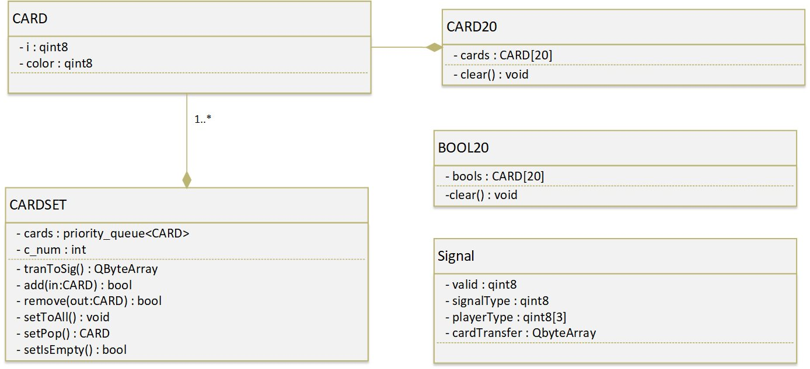
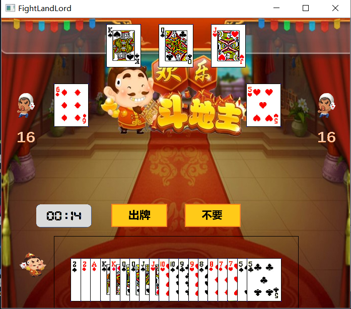

**分工任务的解决方案**

- **分工任务**
  - 在viewmodel层向view层或window层提供绑定的接口。
  - 维护需要在客户端界面显示的全部信息。
  - 能够对卡组进行分类和比较。
  - 设计通用的基本类和基本的宏，满足各层之间的信息传递需要。
- **解决方案**
  - 设计common层，其中包含基本的：表示卡与卡组的结构体（类），用于传递信息的信号结构体，用于客户端界面表示的类，以及标定信号类别的宏定义。
  - 设计model层，其中包含algorithm层，在algorithm层中能够对卡组进行分类和比较。在model层设计一个玩家类，包含每一个玩家的基本游戏信息（对玩家游戏信息的内容修改在model层进行），对command和notification响应。
  - 设计viewmodel层，区别于model层，收到model层的notification后，维护那些需要显示在客户端界面的信息。该层的类将model层中的玩家类作为私有成员，并能够进行相关的绑定（为了command和notification的传递）。
  

**设计思路**

- **common层**
  - 卡片结构体CARD：代表一张卡，包含数字和花色，提供初始化，赋值和比较等基本操作。
  - 卡组类CARDSET：代表一组卡，私有成员包含CARD的堆以及堆中CARD的个数。主要提供卡组的增加卡，减少卡，卡组间的增减，以及发牌（生成特定卡组类，以及分发）的函数。由于信号在客户端和服务端间是通过QbyteArray形式传递的，提供有关QByteArray的类型转换函数。
  - CARD20类：封装了一个CARD[20]数组，用于model和viewmodel层的信息表示。
  - BOOL20类：封装了一个bool[20]数组，用于model和viewmodel层的信息表示。
- **model层**
	- algorithm层
	  - RuleCardSet类：为了进行卡组的分类以及卡组之间的比较维护的类，能与CARDSET类进行相互转化。该类实际上维护了记录卡组中每类牌的数量的数组（比如3的数量，小王的数量），方便进行分类和比较。而卡组的分类与比较的设计思路是通过遍历以上提到的数组，得到连续的单张，连续的三张等数量信息进行分类和比较。
    - model.h 和 model.cpp
      - Player类：私有成员中维护了一名玩家手中的牌，上一次出过的牌，现在在牌桌上的牌（需要去用大小盖过的牌），以及该玩家的状态。提供从viewmodel层接收command的槽函数和从socket层接收notification的槽函数，并能够向socket层发送command信号，以及向viewmodel发送notification信号。每次对于viewmodel层传来的command信号，先进行判断，可能直接判断后做出修改传notification给viewmodel层，也可能判断后传command给socket，等广播收到socket来的notification是再做修改，并向上传递notification信号。
- **viewmodel层**
  - modelView类：私有成员中包含了一个socket，以及三个Player（下家，自己，上家），方便进行初始化和绑定。私有成员中同时维护了三个Player的手中的牌，上一轮出过的牌，以及自己选中的牌的信息。同样有两个槽函数，接收command和notification，viewmodel会直接向model层传递command信号，而在接收来自model的notification信号时，根据三个私有成员的相关函数对需要显示的信息进行维护。
  

**图表说明**

*Qt中的信号机制（信号和槽函数）没有在类图中予以展示，可以认为是QObject的特性*

- **viewmodel层类图:**

  

- **algorithm层类图：**

  

- **model层类图:**

  

- **common层类图:**

  

**运行效果**

   

   

   

**心得体会**

   本人在课程中学习了`git`、`MVVM`开发框架及`Qt `中的信号传递机制。通过老师提供的代码进一步认识了动态绑定的功能强大，学会了在`GitHub`上进行多人协作的开发，初步体会到了多人协作开发中需要知晓的一些注意事项。

**改进建议**

   建议老师缩短课程时间或者提高对大作业的要求。

